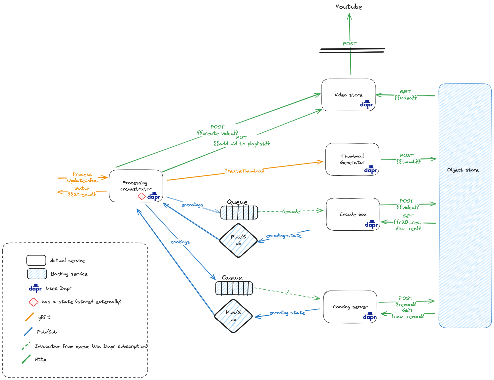

# Processing Orchestrator

## Description

Processing Orchestrator is a project written in Go. It is designed to handle and process jobs related to audio and video processing.

It's specifically designed to be the post-processing part of the [Discord and Roll20 recording system](https://github.com/SoTrxII/record-orchestrator).

Once a recording is done, this orchestrator will combine the roll20 and discord audio, and then process it to a video, 
create a thumbnail for it and upload it the video store.



## Features
- Job processing: The system can recover and restart processing jobs from any state.
- Video playlist: The system can add a video to a playlist. If no playlist is provided, it creates one and adds the video to it.
- Thumbnail generation: The system can generate a thumbnail for a job.

## Usage
The orchestrator uses a gRPC API. The proto file is available in the [proto](./proto) folder.

### Start processing
To start the processing, send a request to the `start` endpoint of the orchestrator service.

```bash 
gprcurl -plaintext -d '{"discordAudioKeys": ["discord_key1", "discord_key2"], "backgroundAudioKey": "roll20_key "}' localhost:55556 processor.ProcessService/Start
```

|Parameters| Description                                                              | Required |
|----------|--------------------------------------------------------------------------|----------|
|`DiscordAudioKeys`| The keys of the main audio part, the voice from Discord                  | Yes |
|`BackgroundAudioKey`| The key of the Roll20 recording, which will be blended in the background | Yes |

The response will contain the processing job ID.

```json
{"jobId": "job_id"}
```

### Watch processing
To watch the processing, send a request to the `watch` endpoint of the orchestrator service.

```bash
gprcurl -plaintext -d '{"jobId": "job_id"}' localhost:55556 processor.ProcessService/Watch
```

|Parameters| Description | Required |
|----------|-------------|----------|
|`jobId`| The ID of the processing job | Yes |

This is a streaming endpoint, and it will return the processing status of the job. The status is a `ProcessingStatus` object.

```protobuf
message ProcessingStatus {
string id = 1;
string error = 2;
repeated string stepsList = 3;
uint32 currentStepIndex = 4;
repeated string itemList = 5;
uint32 currentItemIndex = 6;
// All processing is done
bool done = 7;
// Progress as a user friendly string
string progress = 8;
// Final video link, only available when done is true
string link = 9;
// Created playlist link, only available when done is true
// Can be empty if no playlist was created
string createdPlaylistLink = 10;
}
```

### Updating information
While processing, you can update the information of the processing job. This includes the video title, description, visibility, playlist, and thumbnail.

To update the information of a processing job, send a request to the `update` endpoint of the orchestrator service.

```protobuf
enum Visibility {
  PRIVATE = 0;
  UNLISTED = 1;
  PUBLIC = 2;
  UNKNOWN = 3;
}
message UpdateRequest {
string id = 1;
string vidTitle = 2;
string vidDesc = 3;
Visibility vidVisibility = 4;
string playlistId = 5;
string playlistTitle = 6;
Thumbnail thumbnail = 7;
}

message Thumbnail {
string bgUrl = 1;
string title = 2;
string subtitle = 3;
uint32 number = 4;
}

```


## Installation
To install the project, you need to have Go installed on your system. Then, you can clone the repository and run the project.

```bash
git clone https://github.com/SoTrx/processing-orchestrator.git
cd processing-orchestrator
go run .
````

You will also need to have the following backing services running:
- Dapr
- A state storage solution. Redis is used, as it comes with Dapr by default.
- A pubsub solution. Redis is used, as it comes with Dapr by default.
- An object store. Minio is used here, as its close to the S3 API.
- The [uploader](https://github.com/SoTrxII/video-store)
- The [audio processor](https://github.com/SoTrxII/Pandora-cooking-server)
- The [encoder](https://github.com/SoTrxII/encode-box)
- (Optional) The [thumbnail generator](https://github.com/SoTrxII/thumbnail-generator)

A all in one deployment will be provided in the future.

## Configuration
The project uses environment variables for configuration. The following variables are used:

| Variable         | Description                                                                                          | Required | Default           |
|------------------|------------------------------------------------------------------------------------------------------|----------|-------------------|
| `DAPR_GRPC_PORT` | Port used by the dapr sidecar. Automatically provided on proper deployments                          | No       | ``50001``         |
| `SERVER_PORT`    | Port used for the orchestrator gRPC server                                                           | No       | ``55556``         |
| `UPLOADER_NAME`  | Dapr component name for the uploader component                                                       | No       | ``video-store``   |
| `THUMB_GEN_NAME` | Dapr component name for the thumbnail generator component. Thumbnail isn't generated if not provided | No       | ``                |
| `PUBSUB_NAME`    | Dapr component name for the queue component                                                          | No       | ``message-queue`` |
| `SUB_NAME`       | Dapr component name for the event subscription component                                             | No       | ``pubsub``        |
| `STORE_NAME`     | Dapr component name for the state store component                                                    | No       | ``statestore``    |

